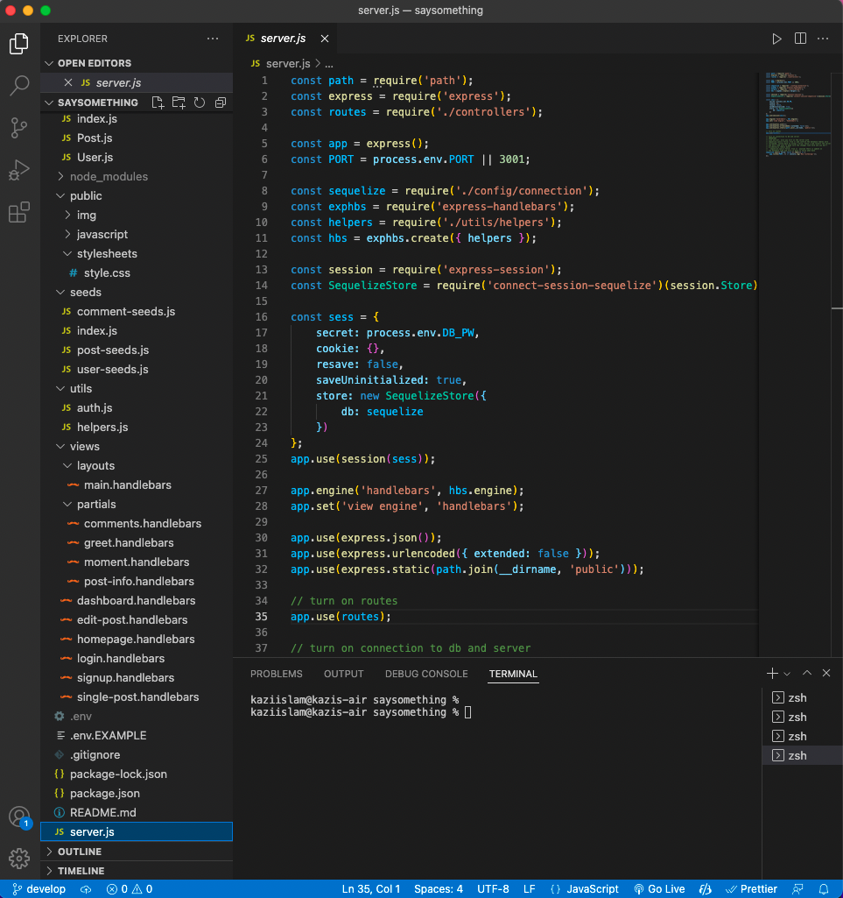
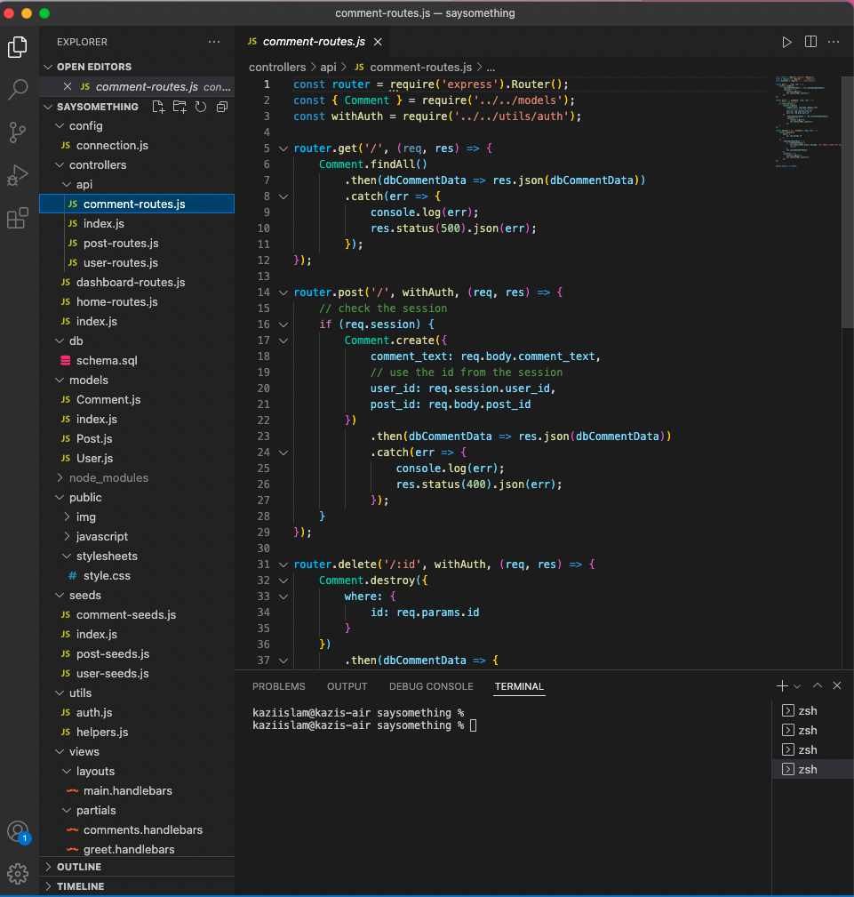
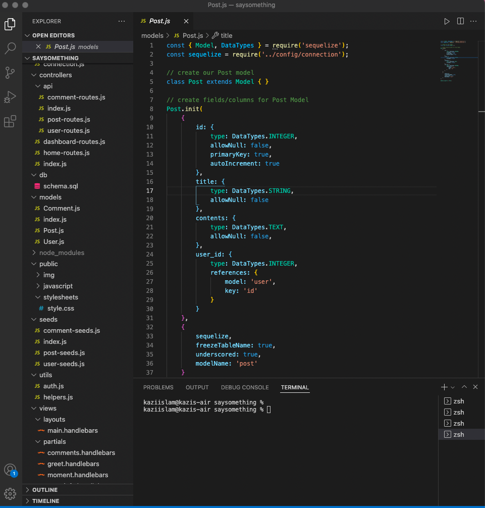
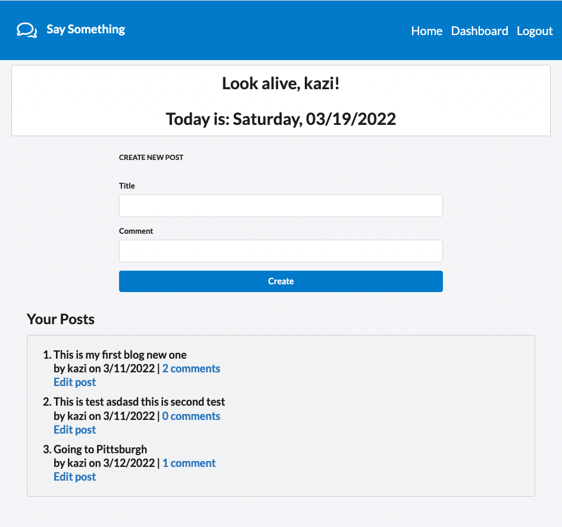
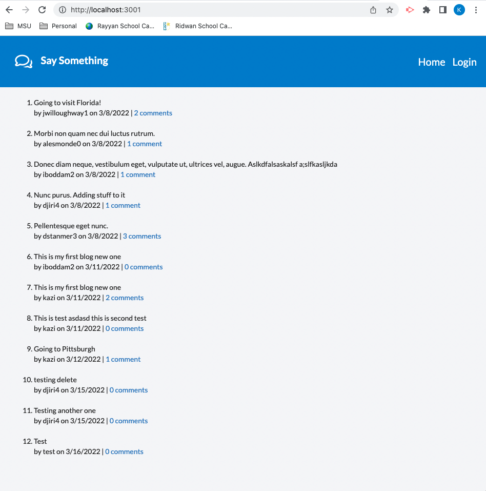
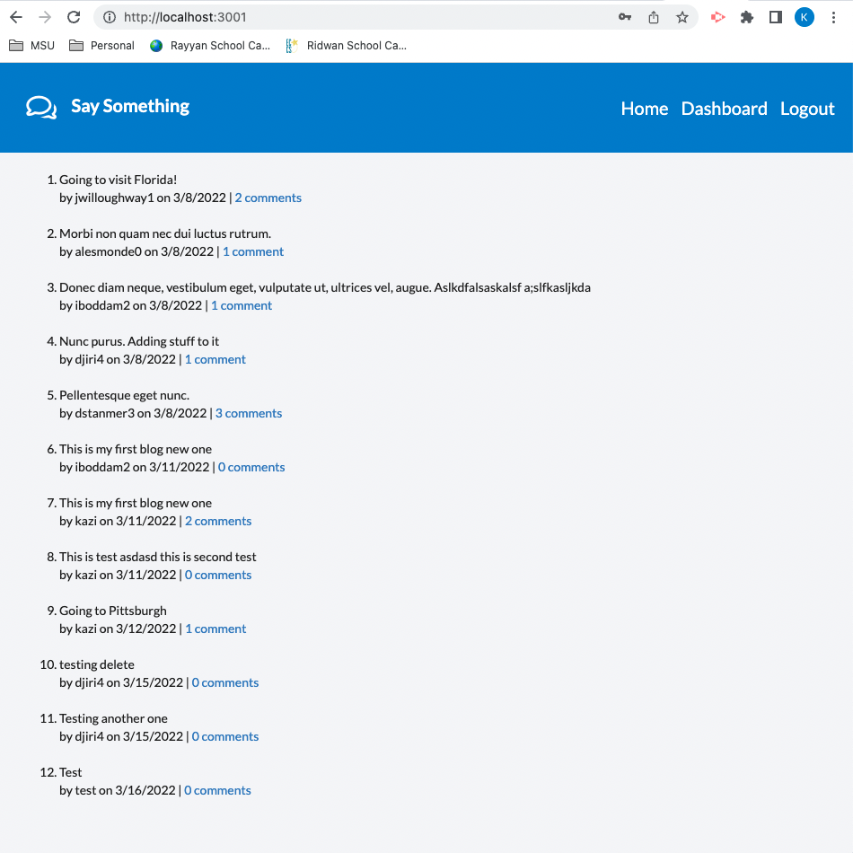

# SaySomething

## Table of contents

1. [Title](#title)
2. [Description](#description)
3. [Installation](#installation)
4. [Usage](#usage)
5. [Contributing](#contributing)
6. [Test](#test)
7. [License](#license)
8. [Questions](#questions)

## Title

SaySomething

## Description

An app for folks with stuff to say

## Technologies used on this project

`bcrypt connect-seesion-sequelize dotenv express express-handlebars express-session greet-by-time moment mysql2 sequelize and Semantic-UI, greet-by-time uses displays new message everytime user logs in, Moment.js to show day/date etc`

## Installation

Run `npm i bcrypt connect-seesion-sequelize dotenv express express-handlebars express-session greet-by-time moment mysql2 sequelize`

## Usage

run `npm start` to start the application

## Contributing

Always create a branch and do PR once ready

## Test

test on local environment

## License

[MIT](https://gist.github.com/nicolasdao/a7adda51f2f185e8d2700e1573d8a633#mit-license)

## Questions

Do not have any question at this time 
Find me on Github [kazichaska](https://github.com/kazichaska) 
Email me with any question: kazichaska@gmail.com  

## Deployed Application Video Link

Application has been deployed to Heroku
https://afternoon-island-61573.herokuapp.com/

## Screenshots of the code

